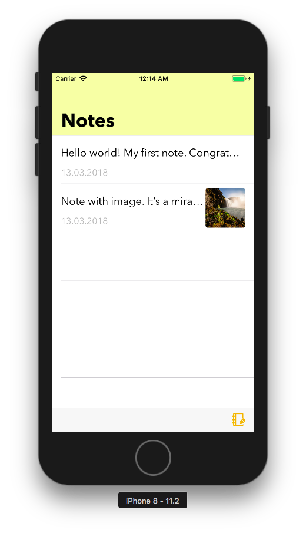
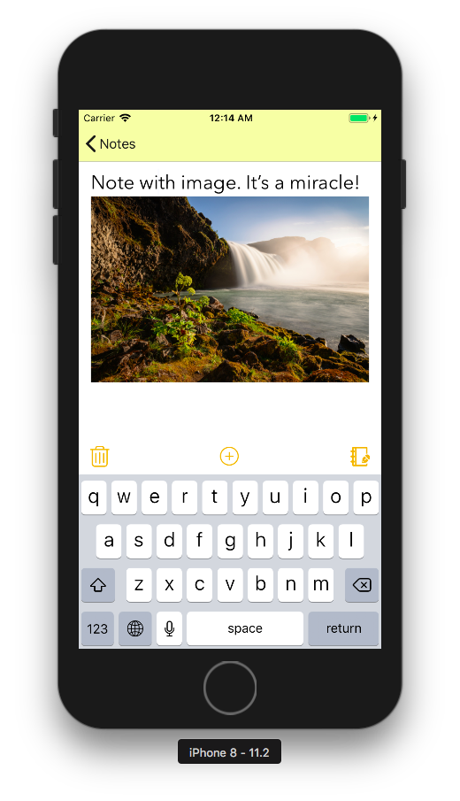

# Swift Projects

Projects: 

* Notes
* MusicPlayer

### Notes

Simple notes with image saving, search by notes and Core Data.

 

### MusicPlayer

Music Player is created with MediaPlayer and some third-party frameworks: [LNPopupController](https://github.com/LeoNatan/LNPopupController) and [UPCarouselFlowLayout](https://github.com/ink-spot/UPCarouselFlowLayout)

Features:

*  Player popupbar
*  Search by songs' title
*  Recently played music collection view
*  Playlists list
*  Artists list
*  Albums list
*  All songs list
*  Podcasts list 

   

